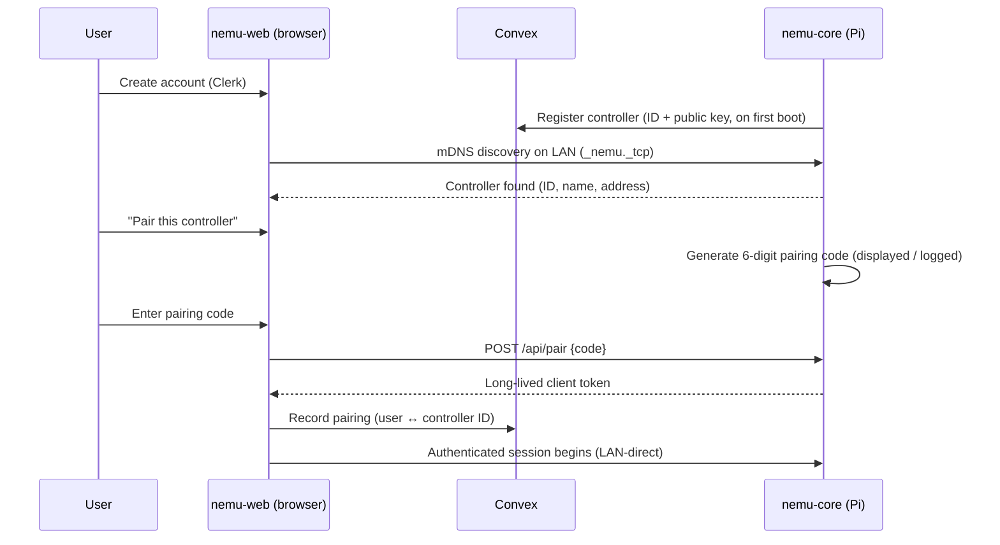

# Nemu — Design Document

**Status:** Draft v1
**Last updated:** 2026-07-04

Nemu is a privacy-first smart home controller. All home state — devices, names,
rooms, telemetry, voice audio — lives on a controller you own (a Raspberry Pi in
your house). The cloud exists only to bootstrap: accounts, controller discovery,
pairing, and an ephemeral message relay for when you're away from home. Nothing
about your home is ever stored in the cloud.

Related documents:

- [Architecture overview](architecture/overview.md) — system diagram, hybrid connectivity, trust boundaries
- [Rust core](architecture/core.md) — module layout, API surface, MQTT bridge
- [Webview](architecture/webview.md) — Next.js / Convex / Clerk, pairing, relay
- [Voice pipeline](architecture/voice.md) — wake word → STT → intent → TTS, Pi 4 / Pi 5 tiers
- [Data model](architecture/data-model.md) — Postgres ERD, Convex schema, MQTT topics, WS messages

---

## 1. Vision

A smart home you actually own. Buy a Zigbee dongle, plug it into a Pi, run one
`docker compose up`, and control your home from a polished web app or your
voice — without a single byte of home data leaving your network unless you
explicitly ask it to (and even then, only in transit, never at rest).

## 2. Goals

- **Local-first.** The controller is the source of truth. It works fully with
  the internet unplugged (except cloud-relayed remote access).
- **Privacy by architecture, not policy.** The cloud components are physically
  incapable of storing home data because the schema has nowhere to put it.
- **Real product UX.** Account creation, controller pairing, device naming, and
  rooms should feel like a consumer product, not a hobbyist dashboard.
- **Voice without the cloud.** Wake word, speech-to-text, intent handling, and
  responses all run on the Pi.
- **Cheap, common hardware.** Raspberry Pi 4 as the floor; Pi 5 (16 GB) as the
  recommended production target.

## 3. Non-goals (for now)

- Protocols beyond Zigbee (Z-Wave, Matter/Thread, BLE) — the MQTT-centric
  design leaves the door open, but v1 is zigbee2mqtt only.
- Multi-controller homes / controller clustering.
- Native mobile apps. The webview is the client; a wrapped webview app can come
  later without architectural change.
- Cloud-hosted automations or third-party integrations (IFTTT, Alexa, Google
  Home). These conflict with the privacy posture.

## 4. Privacy principles

These are hard constraints, enforced by design reviews on every milestone:

1. **The controller holds all home state.** Devices, friendly names, rooms,
   scenes, telemetry, event history, and automation rules live only in the
   controller's Postgres.
2. **The cloud stores identity and bindings only.** Convex holds: Clerk user
   identity, controller registrations (an opaque controller ID + public key),
   and pairing records binding accounts to controllers. That is the complete
   list.
3. **The relay is a pipe, not a store.** When the webview is off-LAN, commands
   and responses pass through Convex as short-lived, end-to-end structured
   messages with aggressive TTL cleanup. Relay messages are never queryable
   after delivery and are deleted on a schedule.
4. **Voice never leaves the device.** Audio capture, wake word detection, STT,
   intent parsing (including the LLM), and TTS all run on the Pi. There is no
   code path that uploads audio.
5. **Telemetry is opt-in and anonymous.** No analytics in v1.

## 5. System overview

Nemu is two deployable parts:

| Part | Runs on | Stack | Responsibility |
|---|---|---|---|
| **nemu-core** | Raspberry Pi (Docker Compose) | Rust (Axum, Diesel, rumqttc), Mosquitto, zigbee2mqtt, Postgres | Everything: device control, state, API, voice, pairing |
| **nemu-web** | Vercel + Convex + Clerk | Next.js (App Router), Convex, Clerk | Accounts, controller discovery/pairing UI, control UI, relay fallback |

The webview is a thin client. It renders whatever the controller's API serves
and holds no authoritative state of its own. See the
[architecture overview](architecture/overview.md) for the full component
diagram and trust boundaries.

### Connectivity model (hybrid)

1. **LAN-direct (preferred).** The webview connects straight to the
   controller's Axum API over the local network (mDNS-discovered or a
   remembered address). Zero cloud involvement per request.
2. **Cloud relay (fallback).** When the controller isn't reachable on the LAN,
   the webview sends commands through Convex; the controller maintains an
   outbound subscription and picks them up, pushing responses back the same
   way. Messages are ephemeral (TTL + scheduled deletion).

The client probes and switches automatically; the user just sees
"Connected — Home" or "Connected — Remote".

## 6. User flows

### 6.1 First-run setup

- The pairing code proves physical/LAN proximity; the Convex record enables
  later relay fallback and multi-device sign-in.
- The client token is minted and validated by the controller — the cloud can't
  forge access to a home.

### 6.2 Daily control

Open the webview → Clerk session restores → connection manager tries the
remembered LAN address (then mDNS, then relay) → dashboard streams live device
state over WebSocket (LAN) or relay messages (remote). Toggling a light is one
POST to the controller, which publishes to `zigbee2mqtt/<device>/set`.

### 6.3 Device pairing and naming

1. User taps "Add device" in the webview.
2. Controller tells zigbee2mqtt to `permit_join` for 120 s.
3. New device interview events stream to the webview as they happen.
4. User names the device and assigns a room; the controller renames it in
   zigbee2mqtt and records it in Postgres.

### 6.4 Voice command

"Hey Nemu, turn off the kitchen lights" → wake word fires → STT transcribes →
intent layer resolves `{action: off, target: room:kitchen, domain: light}` →
executor publishes the MQTT commands → Piper speaks a short confirmation.
Entirely on-device; see [voice.md](architecture/voice.md).

## 7. Deliverables

Work is organized into milestones. Each lists concrete deliverables with
acceptance criteria. Existing scaffold: `docker-compose.dev.yml` (mosquitto,
zigbee2mqtt, postgres), `apps/core` (Axum skeleton, Diesel `devices` table,
`/api/health`), and the `Justfile` workflows.

### M0 — Foundation (mostly done)

| Deliverable | Acceptance criteria |
|---|---|
| Docker Compose dev stack | `just infra` brings up mosquitto, zigbee2mqtt, postgres; z2m sees the Zigbee dongle |
| Axum app skeleton | `just dev-core` serves `/api/health` returning 200 |
| Diesel setup + first migration | `just db-migrate` creates `devices`; models compile with `check_for_backend` |
| **Remaining:** connection pooling | Replace `Arc<Mutex<PgConnection>>` with an async pool (deadpool + diesel-async); handlers get connections from shared `AppState` |
| **Remaining:** core container | `apps/core` has a Dockerfile (cross-compiled for arm64) and joins the compose stack |

### M1 — Device control

| Deliverable | Acceptance criteria |
|---|---|
| MQTT bridge service | Core maintains a resilient rumqttc connection; subscribes `zigbee2mqtt/#`; reconnects with backoff |
| Device registry sync | `zigbee2mqtt/bridge/devices` payloads upsert the `devices` table; removals are detected |
| Live state cache | Per-device state retained in memory; queryable via API without touching MQTT |
| Command API | `POST /api/devices/{id}/set` publishes to `zigbee2mqtt/<addr>/set`; invalid devices → 404 |
| Device CRUD API | List/get/rename devices; rename propagates to zigbee2mqtt `friendly_name` |
| WebSocket state stream | `GET /ws` pushes device state changes in real time; survives z2m restarts |
| Rooms | `rooms` table + assignment; devices filterable by room |
| Pairing mode API | `POST /api/zigbee/permit-join` opens joining for a bounded window; interview progress streamed over `/ws` |

### M2 — Webview and controller pairing

| Deliverable | Acceptance criteria |
|---|---|
| Next.js app scaffold | App Router, TypeScript strict, Tailwind; deployed to Vercel |
| Clerk auth | Sign-up/sign-in; middleware-protected routes; `ConvexProviderWithClerk` wired |
| Convex schema (cloud-side) | `controllers`, `pairings` tables with validators + indexes; **no fields capable of holding device data** |
| Controller registration | On first boot, core registers with Convex (controller ID + public key) via an HTTP action |
| mDNS discovery | Core advertises `_nemu._tcp`; webview discovers it (direct probe of `nemu.local` + candidate scan fallback) |
| Pairing handshake | 6-digit code flow from §6.1; controller mints a client token; Convex records the binding |
| Controller auth on core API | All non-pairing routes require a valid client token; tokens revocable from the webview |
| LAN-direct control UI | Dashboard: rooms, devices, toggles/sliders, live state via `/ws`; device add + rename flows |

### M3 — Hybrid relay

| Deliverable | Acceptance criteria |
|---|---|
| Relay channel (Convex) | Ephemeral `relayMessages` table; TTL + scheduled cleanup; messages addressed by controller ID |
| Controller relay client | Core holds an outbound connection to Convex, receives commands, executes locally, pushes responses |
| Client connection manager | Webview probes LAN first, falls back to relay; visible Home/Remote indicator; automatic switchover both directions |
| Relay auth | Relay commands carry the controller-issued client token; the controller verifies it — Convex is never trusted to authorize |
| Privacy audit | Confirm relay payloads are deleted post-delivery and unreadable to other users; document retention in overview.md |

### M4 — Voice

| Deliverable | Acceptance criteria |
|---|---|
| Audio capture + wake word | openWakeWord (or Porcupine) detects "Hey Nemu" reliably on a Pi 4 with a USB mic |
| STT | whisper.cpp (quantized tiny/base) transcribes command utterances; end-of-speech detection |
| Intent tier 1 (Pi 4) | Deterministic grammar matcher covers on/off/dim/scene/room commands with <100 ms parse time |
| Intent tier 2 (Pi 5) | Local LLM (llama.cpp / Ollama, ~3–4B quantized) handles free-form phrasing via structured JSON tool-calls into the same executor |
| Voice executor | Intents map to the same command layer as the HTTP API (single code path) |
| TTS feedback | Piper speaks confirmations/errors locally |
| Config-tiered pipeline | STT/intent backends selected by config; swapping tiers requires no code change |

### M5 — Hardening

| Deliverable | Acceptance criteria |
|---|---|
| TLS on the core API | Self-signed cert with trust-on-first-use pinning (or local CA); webview handles it gracefully |
| Secrets & token hygiene | Client tokens hashed at rest; pairing codes single-use with expiry; MQTT auth enabled |
| Backups | One-command encrypted backup/restore of Postgres + z2m config to local disk/USB |
| Updates | Documented compose-based update path with migration safety (Diesel migrations run on boot) |
| Observability | Structured logs (tracing), `/api/health` covering MQTT + DB + z2m, basic on-device event log UI |

## 8. Key risks

| Risk | Mitigation |
|---|---|
| Browser mDNS limitations (browsers can't do true mDNS) | Probe `nemu.local` over HTTP(S) + remembered address + manual IP entry as fallback; discovery is a convenience, not a dependency |
| Mixed-content / self-signed TLS from an HTTPS-served webview to a LAN controller | Address early in M2 with a spike; options: TOFU cert install page served by the controller, or relay-only until cert trusted |
| Pi 4 too weak for LLM intent parsing | Tiered design: grammar matcher is the Pi 4 default and always available as fallback on Pi 5 |
| Convex relay latency for remote control | Acceptable for remote use; LAN path is the primary experience |
| zigbee2mqtt breaking changes | Pin the image version; bridge code isolated in one module with integration tests against recorded payloads |
