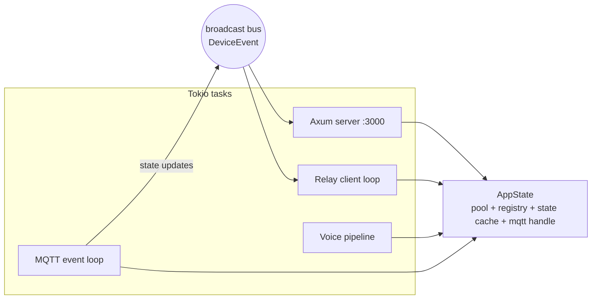

# nemu-core — Rust Controller Architecture

The core is a single Rust binary (`apps/core`) that owns everything on the
controller: the HTTP/WebSocket API, the zigbee2mqtt bridge, the device
registry and live-state cache, pairing/auth, the relay client, and the voice
pipeline entry point.

Current scaffold: Axum 0.8, Diesel 2 (+ diesel-async), rumqttc, a `devices`
table, and `/api/health`. This document describes where it goes from there.

## 1. Module layout

Evolves the existing `api/`, `client.rs`, `db/` structure:

```
apps/core/src/
├── main.rs              # boot: config, pool, services, serve
├── config.rs            # env/config file loading (NEMU_* vars)
├── state.rs             # AppState: pool, registry, mqtt handle, broadcast bus
├── api/                 # Axum layer (exists)
│   ├── router.rs        # route table + middleware
│   ├── health.rs        # (exists)
│   ├── devices.rs       # device CRUD + commands
│   ├── rooms.rs
│   ├── zigbee.rs        # permit-join etc.
│   ├── pairing.rs       # pairing code + token minting (unauthenticated)
│   ├── ws.rs            # /ws live state stream
│   └── auth.rs          # client-token extractor / middleware
├── mqtt/
│   ├── connection.rs    # rumqttc event loop, reconnect w/ backoff
│   └── z2m.rs           # zigbee2mqtt topic parsing + command publishing
├── devices/
│   ├── registry.rs      # DB-backed device registry, sync from bridge/devices
│   └── state_cache.rs   # in-memory latest-state per device
├── commands.rs          # single command executor (API + voice + relay all call this)
├── pairing/
│   ├── codes.rs         # short-lived pairing codes
│   └── tokens.rs        # client token mint/verify/revoke (hashed at rest)
├── relay/
│   └── client.rs        # outbound Convex subscription + mailbox processing
├── voice/               # see voice.md — trait-based pipeline
└── db/                  # (exists) schema.rs, models.rs, mod.rs
```

Guiding rule: `api/`, `relay/`, and `voice/` are thin transports. They all
funnel into `commands.rs` and `devices/`, so a light toggle behaves identically
whether it came from HTTP, the relay, or a spoken sentence.

## 2. Runtime shape



- **AppState** (cheaply clonable, `Arc` inside) replaces the current
  `Arc<Mutex<PgConnection>>`:

```rust
#[derive(Clone)]
pub struct AppState {
    pub db: deadpool_diesel::postgres::Pool,      // or diesel-async + deadpool
    pub registry: Arc<DeviceRegistry>,
    pub state_cache: Arc<StateCache>,
    pub mqtt: MqttHandle,                          // clone of rumqttc AsyncClient
    pub events: broadcast::Sender<DeviceEvent>,
}
```

  A blocking `PgConnection` behind a mutex serializes every request and blocks
  the async runtime; the pool is the first refactor (M0 remainder).
  `NemuClient`/`NemuRouter` fold into `main.rs` + `state.rs` + `api/router.rs`.

- **Event bus.** A `tokio::sync::broadcast` channel of `DeviceEvent` decouples
  the MQTT loop from consumers (`/ws` sessions, relay snapshots, voice
  confirmations).

## 3. MQTT bridge (zigbee2mqtt)

`mqtt/connection.rs` owns one rumqttc `AsyncClient` + event loop with
exponential backoff reconnect. On (re)connect it subscribes to `zigbee2mqtt/#`
and requests a registry resync.

Topic map (see [data-model.md](data-model.md) for payload details):

| Direction | Topic | Purpose |
|---|---|---|
| in | `zigbee2mqtt/bridge/devices` | full device list → registry sync (upsert/remove in Postgres) |
| in | `zigbee2mqtt/bridge/event` | join/leave/interview events → `/ws` + pairing UX |
| in | `zigbee2mqtt/bridge/state` | z2m health → `/api/health` |
| in | `zigbee2mqtt/<friendly_name>` | device state → state cache + `DeviceEvent` |
| out | `zigbee2mqtt/<friendly_name>/set` | commands |
| out | `zigbee2mqtt/bridge/request/permit_join` | open pairing window |
| out | `zigbee2mqtt/bridge/request/device/rename` | rename propagation |

Registry sync is idempotent: `bridge/devices` is the source of truth for
existence and `ieee_address`; Postgres adds nemu-owned fields (room, display
metadata). Renames initiated in nemu go *to* z2m so the two never diverge.

## 4. API surface

All routes require the client-token middleware except `/api/health` and the
pairing endpoints.

| Method + path | Purpose |
|---|---|
| `GET /api/health` | liveness: DB, MQTT, z2m bridge state |
| `POST /api/pair` | exchange pairing code for a client token |
| `GET /api/devices` | registry + latest cached state (optional `?room=`) |
| `GET /api/devices/{id}` | one device + state |
| `PATCH /api/devices/{id}` | rename / assign room (propagates to z2m) |
| `POST /api/devices/{id}/set` | send a command payload (`{"state":"OFF"}`, `{"brightness":128}`) |
| `GET /api/rooms` / `POST /api/rooms` / `PATCH /api/rooms/{id}` / `DELETE ...` | room CRUD |
| `POST /api/zigbee/permit-join` | `{seconds: 120}` open join window |
| `GET /api/tokens` / `DELETE /api/tokens/{id}` | list / revoke paired clients |
| `GET /ws` | WebSocket: server pushes `DeviceEvent`s; client may send commands (same executor) |

Error convention: JSON `{ "error": { "code": "...", "message": "..." } }`;
404 unknown device, 401 missing/invalid token, 503 dependency down.

## 5. Pairing and auth

- **Pairing codes** (`pairing/codes.rs`): 6 digits, single-use, ~5 minute
  expiry, generated on demand (button in a future local admin page, or CLI/log
  in v1). Stored hashed with expiry in `pairing_codes`.
- **Client tokens** (`pairing/tokens.rs`): random 256-bit values returned once
  on successful `POST /api/pair`; stored as hashes in `client_tokens` with a
  label ("Jack's laptop") and last-seen timestamp. Verified by middleware on
  every request and on every relay message. Revocation deletes the row.
- The controller also holds a keypair generated on first boot; the public key
  goes to Convex at registration and later signs relay responses so clients
  can verify they're talking to the real controller through the relay.

## 6. Relay client

`relay/client.rs` maintains an outbound connection to Convex (HTTP long-poll or
WebSocket against a Convex subscription) filtered to this controller's ID:

1. Receive envelope `{id, clientToken, payload}`.
2. Verify `clientToken` locally (same check as HTTP middleware).
3. Execute via `commands.rs` / query the registry.
4. Write the response envelope back; Convex marks the pair consumed and its
   cleanup job deletes them.

The relay loop is fully independent of the HTTP server — if the internet is
down, only this task idles.

## 7. Database

Schema evolution beyond the existing `devices` table (ERD in
[data-model.md](data-model.md)):

| Table | Milestone | Notes |
|---|---|---|
| `devices` | exists | gains `room_id`, `enabled`, `last_seen` |
| `rooms` | M1 | id, name, sort order |
| `device_events` | M1 | append-only state/command log for history UI; pruned by retention job |
| `pairing_codes` | M2 | code hash, expiry, consumed flag |
| `client_tokens` | M2 | token hash, label, created/last-seen |
| `scenes` / `scene_actions` | M4+ | named groups of command payloads |
| `settings` | M2 | controller name, keypair, Convex registration state |

Diesel migrations remain the change mechanism (`just db-new`, run
automatically at boot in the container so updates are one `compose pull`).

## 8. Concurrency and resilience notes

- Never hold a DB connection across an `.await` on the MQTT/broadcast path;
  fetch from the pool per operation.
- MQTT publishes from handlers go through the cloned `AsyncClient`
  (`MqttHandle`) — no locking around the event loop.
- The state cache is `DashMap`- or `RwLock<HashMap>`-based; writes only from
  the MQTT task, reads from everywhere.
- Backpressure: broadcast channel with bounded capacity; slow `/ws` consumers
  get a lag error and resync via a fresh snapshot rather than blocking the
  MQTT loop.
- z2m restart: on `bridge/state: offline→online`, re-request device list, diff
  the registry, emit a `resync` event on `/ws`.
