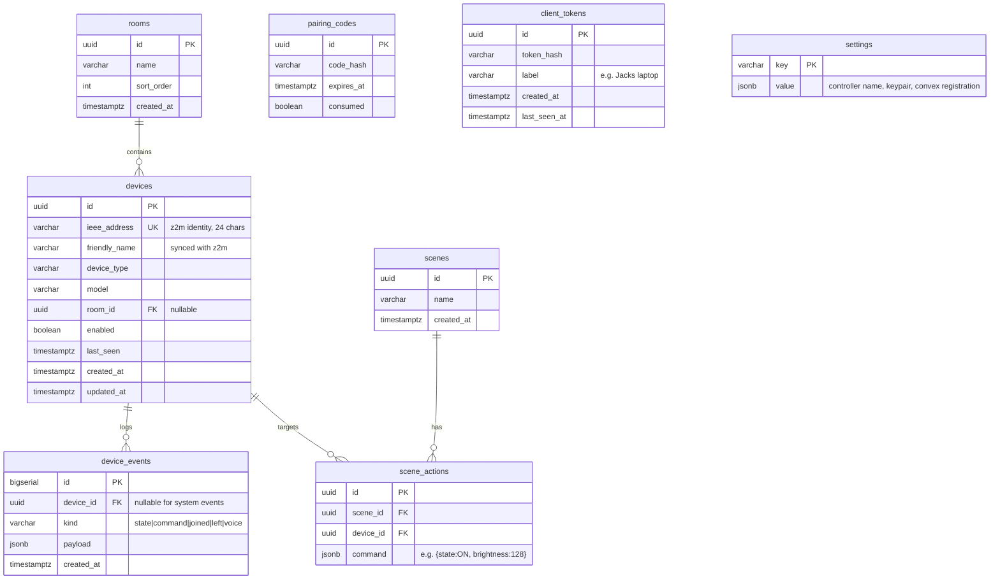

# Data Model

Three data planes, kept deliberately separate:

1. **Postgres on the controller** — all home state (the only durable store).
2. **Convex in the cloud** — identity bindings and an ephemeral relay mailbox.
3. **Wire formats** — MQTT topics between core and zigbee2mqtt, and the
   REST/WebSocket messages between core and the webview.

## 1. Controller Postgres (Diesel)



Notes:

- `devices` extends the existing migration
  (`2026-06-29-050926-0000_devices`) with `room_id`, `enabled`, `last_seen`.
- `ieee_address` stays the join key with zigbee2mqtt; `friendly_name` is
  bidirectionally synced (renames flow nemu → z2m).
- `device_events` is append-only with a retention job (default 30 days);
  it backs the history UI and optional voice transcript log.
- Live device state (brightness, temperature, contact…) is **not** a table —
  it's the in-memory state cache, rebuilt from retained MQTT messages and
  `bridge/devices` on boot. Postgres stores identity and history, not hot
  state.
- Secrets (`pairing_codes.code_hash`, `client_tokens.token_hash`) are hashed;
  plaintext exists only in the initial HTTP response to the client.

## 2. Convex schema (cloud)

```typescript
// apps/web/convex/schema.ts
import { defineSchema, defineTable } from "convex/server";
import { v } from "convex/values";

export default defineSchema({
  controllers: defineTable({
    controllerId: v.string(),   // opaque, generated on first boot
    publicKey: v.string(),      // verifies relay response signatures
    name: v.string(),           // user-chosen, e.g. "Home"
    registeredAt: v.number(),
  }).index("by_controller_id", ["controllerId"]),

  pairings: defineTable({
    userId: v.string(),         // Clerk subject
    controllerId: v.string(),
    createdAt: v.number(),
  })
    .index("by_user", ["userId"])
    .index("by_user_and_controller", ["userId", "controllerId"]),

  relayMessages: defineTable({
    controllerId: v.string(),
    direction: v.union(v.literal("toController"), v.literal("toClient")),
    requestId: v.string(),      // correlates command and response
    payload: v.string(),        // JSON envelope, includes client token
    consumed: v.boolean(),
    expiresAt: v.number(),      // now + a few minutes
  })
    .index("by_controller_and_direction", ["controllerId", "direction", "consumed"])
    .index("by_expiry", ["expiresAt"]),
});
```

- This is the **complete** cloud schema. There is intentionally no table that
  could hold a device, a room, a state value, or a transcript; adding a field
  to this file is a privacy-review event.
- A Convex cron deletes consumed `relayMessages` immediately and anything past
  `expiresAt`.
- All public functions use validators and the `authedQuery`/`authedMutation`
  wrappers; `relay.send` additionally checks a `pairings` row exists for
  `(userId, controllerId)`.

## 3. MQTT topic conventions (core ↔ zigbee2mqtt)

Base topic `zigbee2mqtt` (stock z2m config, pinned image).

| Topic | Dir (from core) | Payload | Used for |
|---|---|---|---|
| `zigbee2mqtt/bridge/state` | sub | `{"state":"online"}` | health |
| `zigbee2mqtt/bridge/devices` | sub | array of device descriptors (`ieee_address`, `friendly_name`, `definition.model`, …) | registry sync |
| `zigbee2mqtt/bridge/event` | sub | `{"type":"device_joined"\|"device_interview"\|"device_leave", "data":{...}}` | pairing UX, registry updates |
| `zigbee2mqtt/<friendly_name>` | sub | device state JSON (`{"state":"ON","brightness":254,...}`) | state cache + events |
| `zigbee2mqtt/<friendly_name>/availability` | sub | `{"state":"online"}` | `last_seen` / offline badges |
| `zigbee2mqtt/<friendly_name>/set` | pub | command JSON (`{"state":"OFF"}`) | device commands |
| `zigbee2mqtt/<friendly_name>/get` | pub | `{"state":""}` | state refresh |
| `zigbee2mqtt/bridge/request/permit_join` | pub | `{"time":120}` | open pairing window |
| `zigbee2mqtt/bridge/request/device/rename` | pub | `{"from":"0x00...","to":"Kitchen Light"}` | rename propagation |
| `zigbee2mqtt/bridge/response/#` | sub | request acks | error surfacing |

Rules:

- Core addresses devices by `ieee_address` where z2m allows it, falling back
  to `friendly_name`; the registry maps nemu UUIDs → addresses so API clients
  never see MQTT details.
- Mosquitto listens only on the compose-internal network in production; MQTT
  auth is enabled in M5.

## 4. Core API wire formats (core ↔ webview)

Shared TypeScript definitions live in `apps/web/lib/types.ts`, mirrored from
the Rust serde types (`shared/` is the future home for a generated contract).

### REST resources

```jsonc
// GET /api/devices → 200
{
  "devices": [
    {
      "id": "6d1e2f…",                 // nemu UUID
      "name": "Kitchen Light",
      "type": "light",
      "model": "TRADFRI bulb E26",
      "roomId": "a41c…",
      "online": true,
      "state": { "state": "ON", "brightness": 254 }   // from the cache
    }
  ]
}

// POST /api/devices/{id}/set
{ "state": "OFF" }                      // passthrough command object

// POST /api/pair
{ "code": "482913", "clientLabel": "Jack's laptop" }
// → 200 { "clientToken": "…" }  (only time the token is transmitted)
```

Errors: `{ "error": { "code": "device_not_found", "message": "…" } }`.
Auth: `Authorization: Bearer <clientToken>` on everything except
`/api/health`, `/api/identify`, `/api/pair`.

### WebSocket `/ws` messages

Server → client (tagged enum, mirrors the Rust `DeviceEvent` broadcast bus):

```jsonc
{ "type": "deviceState",  "deviceId": "6d1e…", "state": { "state": "ON" } }
{ "type": "deviceJoined", "device": { /* device resource */ } }
{ "type": "deviceLeft",   "deviceId": "6d1e…" }
{ "type": "interview",    "ieeeAddress": "0x00…", "status": "started|successful|failed" }
{ "type": "resync" }      // client should refetch /api/devices
{ "type": "health",       "mqtt": true, "zigbee": true, "db": true }
```

Client → server:

```jsonc
{ "type": "command", "requestId": "r1", "deviceId": "6d1e…", "payload": { "state": "OFF" } }
// → { "type": "commandResult", "requestId": "r1", "ok": true }
```

### Relay envelopes (webview ↔ Convex ↔ core)

The relay carries the *same* command/result shapes, wrapped:

```jsonc
// relayMessages.payload (toController)
{
  "requestId": "r1",
  "clientToken": "…",                  // verified by the controller, not Convex
  "message": { "type": "command", "deviceId": "6d1e…", "payload": { "state": "OFF" } }
}

// relayMessages.payload (toClient)
{
  "requestId": "r1",
  "signature": "base64…",              // controller-key signature over message
  "message": { "type": "commandResult", "ok": true }
}
```

One message vocabulary, three transports (HTTP, WebSocket, relay) — the
executor and the UI never care which path a command took.
