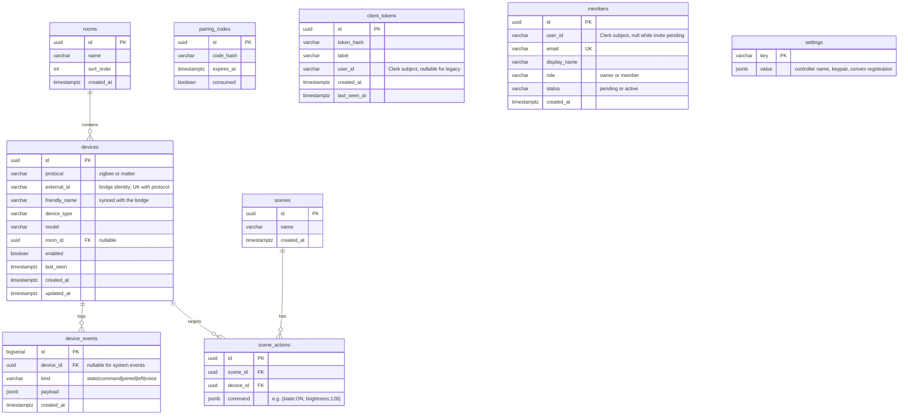

# Data Model

Three data planes, kept deliberately separate:

1. **Postgres on the controller** — all home state (the only durable store).
2. **Convex in the cloud** — identity bindings and an ephemeral relay mailbox.
3. **Wire formats** — MQTT topics between core and zigbee2mqtt, and the
   REST/WebSocket messages between core and the webview.

## 1. Controller Postgres (Diesel)


```mermaid
erDiagram
    rooms ||--o{ devices : contains
    devices ||--o{ device_events : logs
    scenes ||--o{ scene_actions : has
    devices ||--o{ scene_actions : targets

    rooms {
        uuid id PK
        varchar name
        int sort_order
        timestamptz created_at
    }
    devices {
        uuid id PK
        varchar protocol "zigbee or matter"
        varchar external_id "bridge identity; UK with protocol"
        varchar friendly_name "synced with the bridge"
        varchar device_type
        varchar model
        uuid room_id FK "nullable"
        boolean enabled
        timestamptz last_seen
        timestamptz created_at
        timestamptz updated_at
    }
    device_events {
        bigserial id PK
        uuid device_id FK "nullable for system events"
        varchar kind "state|command|joined|left|voice"
        jsonb payload
        timestamptz created_at
    }
    scenes {
        uuid id PK
        varchar name
        timestamptz created_at
    }
    scene_actions {
        uuid id PK
        uuid scene_id FK
        uuid device_id FK
        jsonb command "e.g. {state:ON, brightness:128}"
    }
    pairing_codes {
        uuid id PK
        varchar code_hash
        timestamptz expires_at
        boolean consumed
    }
    client_tokens {
        uuid id PK
        varchar token_hash
        varchar label
        varchar user_id "Clerk subject, nullable for legacy"
        timestamptz created_at
        timestamptz last_seen_at
    }
    members {
        uuid id PK
        varchar user_id "Clerk subject, null while invite pending"
        varchar email UK
        varchar display_name
        varchar role "owner or member"
        varchar status "pending or active"
        timestamptz created_at
    }
    settings {
        varchar key PK
        jsonb value "controller name, keypair, convex registration"
    }
```

Notes:

- `devices` extends the existing migration
  (`2026-06-29-050926-0000_devices`) with `room_id`, `enabled`, `last_seen`;
  migration `2026-08-16-…_devices_protocol` generalizes identity to
  `(protocol, external_id)`.
- `external_id` is the join key with the owning bridge: the z2m
  `ieee_address` for Zigbee, the matterjs-server node id (`nodeId`) for Matter
  strips and single-endpoint nodes, or `nodeId:endpoint` when a multi-endpoint
  node is still split (for example two lights on one node).
  `friendly_name` is bidirectionally synced (renames flow nemu → bridge).
- `device_events` is append-only with a retention job (default 30 days);
  it backs the history UI and optional voice transcript log.
- Live device state (brightness, temperature, contact…) is **not** a table —
  it's the in-memory state cache, rebuilt from retained MQTT messages and
  `bridge/devices` on boot. Postgres stores identity and history, not hot
  state. This includes live `power`/`voltage`/`current`/`energy` readings
  from Matter energy clusters — they stay cache-only until the energy
  management section exists (see [energy.md](energy.md)).
- Secrets (`pairing_codes.code_hash`, `client_tokens.token_hash`) are hashed;
  plaintext exists only in the initial HTTP or session-mint response to the client.
- `members` is the household ACL. Convex `pairings` / `invites` mirror it for
  routing and Google-email invites; they cannot authorize commands.

## 2. Convex schema (cloud)

```typescript
// apps/web/convex/schema.ts
import { defineSchema, defineTable } from "convex/server";
import { v } from "convex/values";

export default defineSchema({
  controllers: defineTable({
    controllerId: v.string(), // opaque, generated on first boot
    publicKey: v.string(), // verifies relay response signatures
    name: v.string(), // user-chosen, e.g. "Home"
    registeredAt: v.number(),
  }).index("by_controller_id", ["controllerId"]),

  pairings: defineTable({
    userId: v.string(), // Clerk subject
    controllerId: v.string(),
    createdAt: v.number(),
    role: v.optional(v.union(v.literal("owner"), v.literal("member"))),
  })
    .index("by_user", ["userId"])
    .index("by_user_and_controller", ["userId", "controllerId"])
    .index("by_controller", ["controllerId"]),

  invites: defineTable({
    controllerId: v.string(),
    email: v.string(), // normalized Google account email
    invitedByUserId: v.string(),
    createdAt: v.number(),
  })
    .index("by_email", ["email"])
    .index("by_controller_and_email", ["controllerId", "email"]),

  relayMessages: defineTable({
    controllerId: v.string(),
    direction: v.union(v.literal("toController"), v.literal("toClient")),
    requestId: v.string(), // correlates command and response
    payload: v.string(), // JSON envelope, includes client token
    consumed: v.boolean(),
    expiresAt: v.number(), // now + a few minutes
  })
    .index("by_controller_and_direction", [
      "controllerId",
      "direction",
      "consumed",
    ])
    .index("by_expiry", ["expiresAt"]),
});
```

- This is the **complete** cloud schema. There is intentionally no table that
  could hold a device, a room, a state value, or a transcript; adding a field
  to this file is a privacy-review event.
- A Convex cron deletes consumed `relayMessages` immediately and anything past
  `expiresAt`.
- All public functions use validators and the `authedQuery`/`authedMutation`
  wrappers; `relay.send` additionally checks a `pairings` row exists for
  `(userId, controllerId)`.

## 3. MQTT topic conventions (core ↔ bridges)

Base topic `zigbee2mqtt` (stock z2m config, pinned image). The `matter-bridge`
sidecar mirrors the same dialect under base topic `matter`, with two
differences: device topics use the Matter external id (`nodeId` for strips
and single-endpoint nodes, or `nodeId:endpoint` when a node is still split)
instead of `friendly_name`, and `bridge/request/commission`
(`{"code":"MT:…","wifiSsid"?,"wifiPassword"?,"transaction"}`) replaces
`permit_join`. Leaving the pairing wizard publishes
`bridge/request/commission/cancel` so the sidecar aborts in-flight BLE.
Matter strip state uses an `outlets` array (no top-level
`state`) plus optional read-only energy keys (`power` W, `voltage` V,
`current` A, `energy` kWh) folded from the Electrical Power/Energy
Measurement clusters.

| Topic                                      | Dir (from core) | Payload                                                                              | Used for                     |
| ------------------------------------------ | --------------- | ------------------------------------------------------------------------------------ | ---------------------------- |
| `zigbee2mqtt/bridge/state`                 | sub             | `{"state":"online"}`                                                                 | health                       |
| `zigbee2mqtt/bridge/devices`               | sub             | array of device descriptors (`ieee_address`, `friendly_name`, `definition.model`, …) | registry sync                |
| `zigbee2mqtt/bridge/event`                 | sub             | `{"type":"device_joined"\|"device_interview"\|"device_leave", "data":{...}}`         | pairing UX, registry updates |
| `zigbee2mqtt/<friendly_name>`              | sub             | device state JSON (`{"state":"ON","brightness":254,...}`)                            | state cache + events         |
| `zigbee2mqtt/<friendly_name>/availability` | sub             | `{"state":"online"}`                                                                 | `last_seen` / offline badges |
| `zigbee2mqtt/<friendly_name>/set`          | pub             | command JSON (`{"state":"OFF"}`)                                                     | device commands              |
| `zigbee2mqtt/<friendly_name>/get`          | pub             | `{"state":""}`                                                                       | state refresh                |
| `zigbee2mqtt/bridge/request/permit_join`   | pub             | `{"time":120}`                                                                       | open pairing window          |
| `matter/bridge/request/commission/cancel`  | pub             | `{"transaction":"..."}`                                                              | abort in-flight Matter pair  |
| `zigbee2mqtt/bridge/request/device/rename` | pub             | `{"from":"0x00...","to":"Kitchen Light"}`                                            | rename propagation           |
| `zigbee2mqtt/bridge/request/device/remove` | pub             | `{"id":"0x00...","force":false,"block":false,"transaction":"..."}`                   | safe network removal         |
| `zigbee2mqtt/bridge/response/device/remove`| sub             | `{"status":"ok","data":{"id":"0x00..."},"transaction":"..."}`                        | confirm removal before delete|
| `zigbee2mqtt/bridge/response/#`            | sub             | request acks                                                                         | error surfacing              |

Rules:

- Nemu only deletes device metadata after Zigbee2MQTT acknowledges a normal
  network removal. It does not expose force removal, which can leave a device
  holding the network key.

- Core addresses Zigbee devices by `friendly_name` and Matter devices by
  `external_id`; the registry maps nemu UUIDs → `(protocol, external_id)` so
  API clients never see MQTT details.
- Removing a Matter device unpairs the **whole node**. A power strip is one
  device; forgetting it removes every outlet with that node.
- Mosquitto listens only on the compose-internal network in production; MQTT
  auth is enabled in M5.

## 4. Core API wire formats (core ↔ webview)

Shared TypeScript definitions live in `apps/web/lib/types.ts`, mirrored from
the Rust serde types (`shared/` is the future home for a generated contract).

### REST resources

```jsonc
// GET /api/devices → 200
{
  "devices": [
    {
      "id": "6d1e2f…",                 // nemu UUID
      "name": "Kitchen Light",
      "type": "light",
      "model": "TRADFRI bulb E26",
      "roomId": "a41c…",
      "online": true,
      "state": { "state": "ON", "brightness": 254 }   // from the cache
    }
  ]
}

// POST /api/devices/{id}/set — passthrough Zigbee2MQTT command objects
{ "state": "OFF" }
{ "brightness": 128 }                   // raw 0–254 (UI shows 0–100%)
{ "color_temp": 250 }                   // mireds
{ "color": { "hex": "#FFAA00" } }

// Cached state may also include color fields the UI maps for display:
// { "state": "ON", "brightness": 254, "color_temp": 370, "color": { "x": 0.4, "y": 0.4 } }

// POST /api/pair
{ "code": "482913", "clientLabel": "Jack's laptop", "userId": "user_…", "email": "you@gmail.com" }
// → 200 { "clientToken": "…", "controllerId": "…" }  (only time the token is transmitted)

// POST /api/members  { "email": "family@gmail.com" }
// GET  /api/members  → { "members": [ { "id", "userId", "email", "role", "status", … } ] }

```

Errors: `{ "error": { "code": "device_not_found", "message": "…" } }`.
Auth: `Authorization: Bearer <clientToken>` on everything except
`/api/health`, `/api/identify`, `/api/pair`. First-run `/api/pairing-code`
is open until a household exists.

### WebSocket `/ws` messages

Server → client (tagged enum, mirrors the Rust `DeviceEvent` broadcast bus):

```jsonc
{ "type": "deviceState",  "deviceId": "6d1e…", "state": { "state": "ON" } }
{ "type": "deviceJoined", "device": { /* device resource */ } }
{ "type": "deviceLeft",   "deviceId": "6d1e…" }
{ "type": "interview",    "externalId": "0x00…", "status": "started|successful|failed" }
{ "type": "resync" }      // client should refetch /api/devices
{ "type": "health",       "mqtt": true, "zigbee": true, "matter": true, "db": true }
```

Client → server:

```jsonc
{
  "type": "command",
  "requestId": "r1",
  "deviceId": "6d1e…",
  "payload": { "state": "OFF" },
}
// → { "type": "commandResult", "requestId": "r1", "ok": true }
```

### Relay envelopes (webview ↔ Convex ↔ core)

The relay carries the _same_ command/result shapes, wrapped:

```jsonc
// relayMessages.payload (toController) — commands still carry the client token
{
  "requestId": "r1",
  "clientToken": "…",                  // verified by the controller, not Convex
  "message": { "type": "command", "deviceId": "6d1e…", "payload": { "state": "OFF" } }
}

// session mint has no client token; core checks members / pending email
{
  "requestId": "r2",
  "message": { "type": "sessionMint", "userId": "user_…", "email": "you@gmail.com", "clientLabel": "Phone" }
}

// relayMessages.payload (toClient)
{
  "requestId": "r1",
  "signature": "base64…",              // controller-key signature over message
  "message": { "type": "commandResult", "ok": true }
}
```

One message vocabulary, three transports (HTTP, WebSocket, relay) — the
executor and the UI never care which path a command took.
