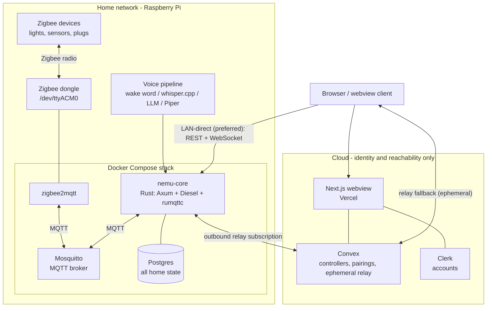
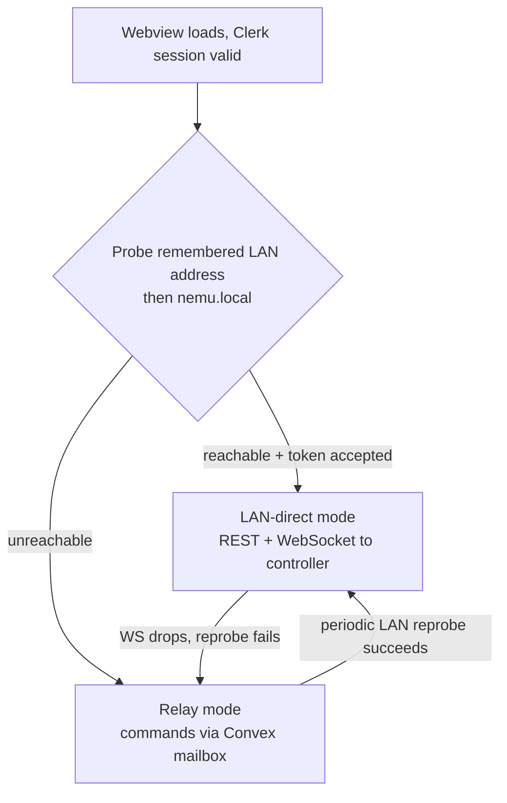
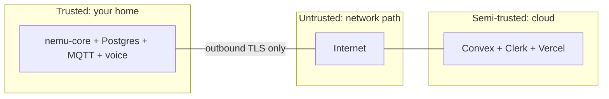

# Architecture Overview

Nemu splits into an on-premises controller (**nemu-core**, everything that
matters) and a thin cloud layer (**nemu-web**, identity and reachability).
This document covers the system-level picture; the per-part details live in
[core.md](core.md), [webview.md](webview.md), [voice.md](voice.md), and
[data-model.md](data-model.md).

## 1. Components

Roles:

- **nemu-core** — the brain. Owns the device registry and live state, exposes
  the HTTP/WebSocket API, bridges to zigbee2mqtt over MQTT, runs the voice
  pipeline, mints and validates client tokens, and speaks to Convex only for
  registration and the relay.
- **Mosquitto / zigbee2mqtt** — stock images. zigbee2mqtt owns the radio;
  nemu-core treats its MQTT topics as the device driver interface.
- **Postgres** — the only durable store of home data. Never replicated to the
  cloud.
- **nemu-web** — Next.js app. UI only; it holds no authoritative state and
  proxies nothing on the LAN path.
- **Convex** — three concerns: controller registrations, account↔controller
  pairings, and an ephemeral relay mailbox.
- **Clerk** — account identity for the webview and Convex functions.

## 2. Hybrid connectivity

The client maintains a single logical "controller connection" with two
transports, chosen automatically:

Preference order and behavior:

1. **LAN-direct.** `GET /api/health` against the remembered address (stored
   client-side after pairing), then `nemu.local`, with a short timeout. On
   success the client opens `/ws` for live state. All traffic stays on the
   home network.
2. **Relay.** The webview writes a command message into the controller's Convex
   mailbox; nemu-core (which keeps an outbound subscription open) executes it
   and writes the response back. Live state in relay mode is coarser
   (request/response + periodic snapshots) — acceptable for remote use.
3. **Switchover.** The client reprobes the LAN in the background while in relay
   mode and upgrades as soon as the controller answers. The UI shows
   `Connected — Home` or `Connected — Remote`.

Authorization is identical on both transports: every command carries the
controller-issued client token, and **only nemu-core validates it**. Convex
routes messages but cannot authorize access to a home; a compromised cloud can
at worst drop or delay traffic.

## 3. Trust boundaries

- The controller never accepts inbound connections from the internet. Its only
  WAN activity is outbound TLS to Convex (registration + relay subscription).
  No port forwarding, no UPnP.
- The cloud is trusted for *identity* (Clerk says who the user is) and
  *routing* (Convex delivers mail) — never for *authorization* (the controller
  checks the client token on every command) or *storage of home data* (the
  schema has no place for it).
- The LAN is trusted in v1 at the transport level, with token auth on every
  API call; TLS with pinned certs lands in M5.

## 4. Privacy data-flow

What data exists where — this table is the contract that milestone reviews
check against:

| Data | Controller (Postgres) | Convex | Clerk | In transit through cloud |
|---|---|---|---|---|
| Account identity (email, etc.) | never | user reference only | yes | — |
| Controller registration (opaque ID, public key, name) | yes | yes | — | — |
| Account↔controller pairing record | token hash | yes (IDs only) | — | — |
| Device inventory, friendly names, rooms | **yes** | **never** | never | never |
| Device state / telemetry / history | **yes** | **never** | never | relay mode only, ephemeral, TTL-deleted |
| Commands ("turn off kitchen") | logged locally | **never stored** | never | relay mode only, ephemeral, TTL-deleted |
| Voice audio / transcripts | processed in memory, transcript optionally logged locally | **never** | never | **never** |
| Automation rules / scenes | yes | never | never | never |

Relay retention: messages are written, delivered, marked consumed, and deleted
by a scheduled Convex cleanup; the TTL is a few minutes at most. There is no
relay history API.

## 5. Deployment shape

- **Controller:** one `docker-compose.yml` on the Pi — `mosquitto`,
  `zigbee2mqtt`, `postgres`, `nemu-core` (arm64 image). The voice pipeline runs
  inside the core container (Pi 5) or as a sibling container with audio device
  access. Dev mirrors this via `docker-compose.dev.yml` + `just dev`.
- **Cloud:** Two Next.js apps on Vercel (`nemu.sh` marketing +
  `dashboard.nemu.sh` control UI), one Convex deployment, one Clerk
  application. Stateless with respect to homes; can be rebuilt from scratch
  without any home losing data (re-pairing restores relay access). See
  [subdomain cutover](../deployment/subdomain-cutover.md).

## 6. Failure modes

| Failure | Behavior |
|---|---|
| Internet down | Everything works on the LAN, including voice. Relay unavailable. |
| Cloud (Convex/Clerk/Vercel) down | LAN control unaffected if the webview is cached / served locally later; remote access unavailable. Home data untouched. |
| Controller down | Nothing works — by design there is no cloud shadow of the home. |
| zigbee2mqtt restart | Core reconnects, resyncs registry from `bridge/devices`, `/ws` clients see a resync event. |
| Postgres down | API returns 503; MQTT command path degrades to registry-cache-only until recovery. |
