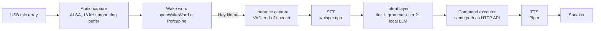

# Voice Pipeline

Voice is a first-class, fully local input method. Audio is captured, detected,
transcribed, understood, executed, and answered **on the Pi**. There is no code
path that sends audio or transcripts off the device.

Hardware reality drives the design: development targets a **Raspberry Pi 4**,
production targets a **Pi 5 with 16 GB RAM**. The pipeline is therefore
_tiered_ — every stage is a swappable backend chosen by config, and the Pi 4
tier must always work as the fallback on any hardware.

## 1. Pipeline



Stages 1–3 run continuously and cheaply; STT and intent only run after the
wake word fires, so idle CPU cost is a few percent.

## 2. Stage choices

### Wake word

- **openWakeWord** (default): open source, ONNX models, runs comfortably on a
  Pi 4 core; custom "Hey Nemu" model trainable from synthetic samples.
- **Porcupine** (alternative): more accurate commercial engine, free tier,
  requires an access key — kept behind the same trait for those who want it.

### Speech-to-text — whisper.cpp

Quantized GGUF models, executed via the `whisper-rs` bindings:

| Hardware | Model                                | Approx. footprint | Expected latency for a 3 s utterance |
| -------- | ------------------------------------ | ----------------- | ------------------------------------ |
| Pi 4     | `tiny.en` q5 (fallback `base.en` q5) | 75–150 MB         | ~1–2.5 s                             |
| Pi 5     | `base.en`–`small.en` q5              | 150–500 MB        | ~0.7–1.5 s                           |

English-only models to start; command vocabulary is narrow enough that `tiny`
is acceptable on the Pi 4.

### Intent — the tiered part

Both tiers produce the same typed output and feed the same executor:

```rust
pub struct Intent {
    pub action: Action,            // TurnOn, TurnOff, SetBrightness, SetColor,
                                   // ActivateScene, QueryState, ...
    pub target: Target,            // Device(id) | Room(id) | All
    pub domain: Option<Domain>,    // Light, Plug, Sensor, ...
    pub value: Option<Value>,      // brightness %, color, temperature
}

pub trait IntentParser: Send + Sync {
    async fn parse(&self, transcript: &str, ctx: &HomeContext) -> Option<Intent>;
}
```

`HomeContext` is the live registry — device names, rooms, scenes — so both
tiers ground against what actually exists in the home.

**Tier 1 — deterministic grammar (Pi 4 default, universal fallback).**
A rule/grammar matcher: normalize the transcript, fuzzy-match device/room
names from the registry (handles STT misspellings), match action phrases
("turn on/off", "dim … to …", "set … to …%", "is … on?"). Parse time is
sub-millisecond–100 ms, fully predictable, and covers the overwhelming
majority of real smart-home commands.

**Tier 2 — local LLM (Pi 5 16 GB).**
A small instruction-tuned model served by **llama.cpp** (or Ollama for
convenience) as a sibling process/container, called over its local HTTP API:

- Candidate models: Llama 3.2 3B Instruct, Qwen 3 4B, Phi-3.5-mini — Q4
  quantized (~2–3 GB RAM), leaving plenty of headroom in 16 GB.
- Prompted with the device/room/scene inventory and constrained to emit a
  JSON `Intent` (GBNF grammar / JSON-schema constrained decoding — the model
  _cannot_ produce anything but a valid intent or a structured "clarify"
  response).
- Handles free-form phrasing tier 1 can't: "it's too dark in here",
  "kill everything downstairs except the hallway", "movie time".
- Expected latency on a Pi 5: ~1–3 s for a short constrained generation.

Resolution order on tier-2 hardware: try tier 1 first (fast path); fall back
to the LLM only when the grammar doesn't match. Tier 1 is always compiled in.

**Rejected alternative:** cloud STT/NLU of any kind — violates the privacy
contract; also considered Rhasspy/Wyoming as an all-in-one, but nemu needs
tight integration with its own registry and executor, so it composes the same
underlying engines (whisper, Piper, openWakeWord) directly.

### Text-to-speech — Piper

Fast local neural TTS; low-quality voices synthesize faster than realtime even
on a Pi 4. Responses are intentionally terse ("Kitchen lights off",
"I found three lights — which one?").

## 3. Latency budget

Wake word → audible confirmation, target end-to-end:

| Stage                     | Pi 4 (tier 1) | Pi 5 (tier 2, LLM path) |
| ------------------------- | ------------- | ----------------------- |
| End-of-speech detection   | ~0.3 s        | ~0.3 s                  |
| STT                       | 1.0–2.5 s     | 0.7–1.5 s               |
| Intent                    | <0.1 s        | 1.0–3.0 s               |
| Execute (MQTT round trip) | <0.2 s        | <0.2 s                  |
| TTS first audio           | ~0.3 s        | ~0.3 s                  |
| **Total**                 | **~2–3.5 s**  | **~2.5–5 s**            |

If tier 2 blows the budget in practice, the mitigation is already built in:
tier 1 handles the common commands instantly and the LLM only sees the
long tail.

## 4. Process model and config

- The voice pipeline runs as a Tokio task set inside nemu-core (`voice/`
  module), with whisper.cpp and Piper linked or spawned as subprocesses; the
  tier-2 LLM runs as a separate container (`llama-server`) in the compose
  stack, enabled by a compose profile.
- Audio requires the container to get the ALSA device
  (`devices: ["/dev/snd"]`) or the pipeline runs as a sibling container with
  only a local socket to the core.

```toml
# nemu.toml (voice section)
[voice]
enabled = true
wake_word = "hey_nemu"          # openwakeword model name
stt_model = "base.en-q5"        # whisper.cpp gguf
intent = "grammar"               # "grammar" | "llm"
llm_endpoint = "http://llm:8080" # used when intent = "llm"
tts_voice = "en_US-lessac-low"   # piper voice
```

Recommended hardware: a USB conference mic / mic array (e.g. 2–4 mic far-field
array) rather than a bare electret — echo cancellation and beamforming matter
more than any software choice for recognition quality.

## 5. Privacy posture

- Raw audio lives only in the in-memory ring buffer and is dropped once
  transcribed; it is never written to disk.
- Transcripts are logged to the local `device_events` log only if
  `voice.log_transcripts = true` (default off).
- The LLM container has no network access besides the compose-internal
  network (`internal: true`), making exfiltration structurally impossible.

## 6. Deliverables mapping (M4)

1. Capture + wake word task with config-selected engine — verified on Pi 4.
2. whisper.cpp STT stage with VAD end-of-speech.
3. Tier-1 grammar `IntentParser` grounded in the registry, with fuzzy name
   matching and unit tests over a phrase corpus.
4. `commands.rs` execution + Piper confirmation.
5. Tier-2 `IntentParser` against llama.cpp with grammar-constrained JSON
   output, compose profile for the LLM container, automatic tier-1 fast path.
