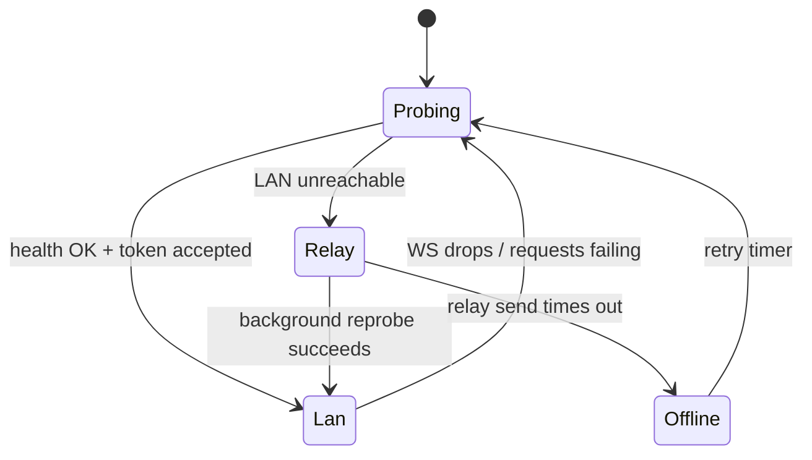

# nemu-web — Next.js / Convex / Clerk Architecture

nemu-web is the account layer and the UI. It is deliberately thin: the
controller's API is the product; the webview renders it. Convex and Clerk
exist to answer two questions the controller can't answer alone — _who is this
user?_ and _how do I reach my controller when I'm not home?_

Planned location: `apps/web` (sibling of `apps/core`).

## 1. What lives in the cloud — and what never does

Convex schema (full definitions in [data-model.md](data-model.md)):

| Table           | Contents                                                                     | Why it's safe                                                      |
| --------------- | ---------------------------------------------------------------------------- | ------------------------------------------------------------------ |
| `controllers`   | opaque controller ID, public key, self-reported name, registration timestamp | no home data; the name is user-chosen ("Home")                     |
| `pairings`      | userId ↔ controllerId binding, created timestamp                             | IDs only                                                           |
| `relayMessages` | ephemeral command/response envelopes, TTL, consumed flag                     | opaque to other users, deleted by scheduled cleanup within minutes |

**Never in Convex:** device inventories, friendly names, rooms, scenes, state,
telemetry, history, voice anything. The schema has no fields for them; adding
one is a privacy-review event.

Clerk holds account identity (email, sessions). Convex functions get the user
via Clerk-issued JWTs — standard `ConvexProviderWithClerk` wiring.

## 2. App structure

```
apps/web/
├── app/
│   ├── layout.tsx              # ClerkProvider > ConvexProviderWithClerk
│   ├── page.tsx                # marketing / sign-in redirect
│   ├── (auth)/sign-in, sign-up # Clerk components
│   ├── setup/                  # discovery + pairing wizard
│   └── home/                   # dashboard: rooms, devices, device detail, settings
├── components/                 # device cards, controls, connection badge
├── lib/
│   ├── controller/
│   │   ├── connection.ts       # ControllerConnection manager (LAN ↔ relay)
│   │   ├── lan.ts              # fetch/WS against the controller API
│   │   ├── relay.ts            # Convex-mailbox transport
│   │   └── discovery.ts        # nemu.local probe + candidate scan
│   └── types.ts                # shared API/WS message types (mirrors core)
├── convex/
│   ├── schema.ts
│   ├── controllers.ts          # register (httpAction from core), get mine
│   ├── pairings.ts             # record/list/remove pairings
│   ├── relay.ts                # send, subscribe, respond, cleanup cron
│   └── auth.config.ts          # Clerk JWT issuer
└── middleware.ts               # clerkMiddleware protecting /home, /setup
```

Convex conventions per house rules: every public function has `args`/`returns`
validators, auth checks via a shared `authedQuery`/`authedMutation` custom
function wrapper, indexes on all lookup paths (`by_controller`,
`by_user`, `by_controller_and_consumed`).

## 3. Controller discovery

Browsers cannot do raw mDNS, so discovery is layered:

1. **Remembered address** from a previous session (localStorage) — instant.
2. **`nemu.local` probe** — the controller advertises `_nemu._tcp` and most
   home OSes resolve `.local`; the webview fetches
   `http://nemu.local:3000/api/health` with a short timeout.
3. **Manual entry** — user types the IP shown by the controller (CLI/log line
   in v1); always available, discovery is a convenience not a dependency.

The health/identify response includes the controller ID and name so the setup
wizard can show "Found: Home (nemu-3f9a)" before pairing.

## 4. Pairing flow

```mermaid
sequenceDiagram
    participant U as User
    participant W as Webview
    participant CV as Convex
    participant C as nemu-core

    Note over C,CV: Boot (once): controller registers ID + public key
    C->>CV: httpAction registerController

    U->>W: Sign in (Clerk)
    W->>C: discover + GET /api/identify
    C-->>W: {controllerId, name}
    U->>C: trigger pairing code (button/CLI)
    C->>C: mint 6-digit code (5 min, single-use)
    U->>W: enter code
    W->>C: POST /api/pair {code, clientLabel, userId, email}
    C-->>W: {clientToken}  — stored client-side only; owner member created
    W->>CV: pairings.create({controllerId})
    CV-->>W: pairing recorded (enables relay + later devices)
    W->>C: authenticated LAN session (token header / WS)
```

Key properties:

- The **client token never touches Convex** during pairing — it goes straight
  from controller to browser and is stored client-side.
- Household **membership** lives on the controller (`members`). Convex
  `pairings` and `invites` are the routing/invite mirror. A pairing row
  cannot command the house; it can only ask the controller to mint a session,
  and the controller checks `members`.
- A new device of an existing member signs in with Google and mints a session
  over the relay — no pairing code. Pairing codes remain for first-owner
  bootstrap and offline LAN fallback.
- Unpairing this browser revokes its token (`DELETE /api/tokens/current`)
  and can leave the Convex pairing intact. Removing a person deletes their
  member row, all of their tokens, and their cloud pairing.

## 5. Connection manager

`ControllerConnection` exposes one interface to the UI
(`getDevices`, `sendCommand`, `onEvent`, `status`, plus LAN-only room/device
configuration) over two transports:


```mermaid
stateDiagram-v2
    [*] --> Probing
    Probing --> Lan: health OK + token accepted
    Probing --> Relay: LAN unreachable
    Lan --> Probing: WS drops / requests failing
    Relay --> Lan: background reprobe succeeds
    Relay --> Offline: relay send times out
    Offline --> Probing: retry timer
```

- **LAN mode:** REST + `/ws` directly against the controller. Full-fidelity
  live state.
- **Relay mode:** `relay.send` Convex mutation writes a command envelope; a
  Convex subscription (`useQuery` on responses) delivers the reply; periodic
  state snapshots are requested rather than streaming every event. UI shows
  `Connected — Remote` and hides latency-sensitive affordances (e.g. live
  slider drag becomes commit-on-release).
- Envelope payloads carry the client token; the controller verifies it before
  executing (see [core.md](core.md) §6). Responses are signed with the
  controller key so the client can detect a spoofed relay.

### 5.1 Device control UI contract

Dashboard controls call `sendCommand({ deviceId, payload })`. Payloads are
Zigbee2MQTT `/set` JSON (passthrough):

| Control | UI | Payload |
| ------- | -- | ------- |
| Power | Switch | `{ "state": "ON" \| "OFF" }` |
| Brightness | 0–100% slider | `{ "brightness": 0–254 }` |
| Color temperature | warm↔cool slider (mireds, default 153–500) | `{ "color_temp": <mireds> }` |
| Color | hex color input | `{ "color": { "hex": "#RRGGBB" } }` |

Rules:

- Controls appear when the corresponding keys exist in the device's live
  state (no capabilities API yet).
- Power toggles are available on device cards and the home quick-control
  surface; brightness/color/color-temp are on the device detail page.
- **LAN:** dimmers/color update live while dragging (debounced ~120 ms).
- **Remote (relay):** commit-on-release — draft value updates while dragging;
  the command is sent on pointer/keyboard release.
- Room assignment and rooms CRUD (`getRooms` / `createRoom` / `patchRoom` /
  `deleteRoom` / `patchDevice`) require a **Home (LAN)** connection. Household
  members and device sessions (`getMembers` / `inviteMember` / `getTokens`)
  work on LAN and relay. Device pairing (`permitJoin`) stays LAN-only.

## 6. Relay implementation sketch (Convex)

- `relay.send(controllerId, payload)` — authed mutation; checks the caller has
  a `pairings` row for `controllerId`; inserts a `relayMessages` row
  `{controllerId, direction: "toController", payload, expiresAt}`.
- Controller subscription — the controller long-polls/subscribes via an authed
  HTTP action for unconsumed `toController` messages, marks them consumed, and
  inserts `toClient` responses.
- `relay.responses(requestIds)` — reactive query the webview subscribes to.
- **Cleanup cron** — a scheduled Convex function deletes consumed rows
  immediately and any row past `expiresAt` (minutes). This job is part of the
  privacy contract, not an optimization.

## 7. HTTPS and mixed content

The webview is served over HTTPS (Vercel) but the controller speaks HTTP on
the LAN in early milestones — browsers block that mixed content. Mitigation
sequence:

- **M2 spike:** decide between (a) controller-served self-signed cert with a
  trust-on-first-use install page, (b) `*.nemu.home`-style local CA, or
  (c) treating relay as the transport whenever the cert isn't trusted yet.
- Until resolved, dev happens on `http://localhost` (no mixed-content rule)
  and the wizard offers relay mode as the fallback path. M5 hardens this
  properly (TLS + pinning).

## 8. UI scope by milestone

| Milestone | UI deliverables                                                                                                                                                      |
| --------- | -------------------------------------------------------------------------------------------------------------------------------------------------------------------- |
| M2        | setup wizard (discover → code → paired), dashboard (rooms CRUD, device cards, power/brightness/color/color-temp), device rename + room assignment, permit-join flow with live interview progress |
| M3        | connection badge (Home/Remote), seamless transport switching, controller/token management in settings                                                                |
| M4        | none required (voice is on-device); optional transcript viewer reading from the controller's local log                                                               |
| M5        | cert-trust onboarding page, backup/restore triggers, event history view                                                                                              |
